Hallo dit wordt een belastings formulier in de stijl van de NS. Dit is een schoolopdracht!!!.

# proces week 1
NS: https://www.ns.nl/
https://www.werkenbijns.nl/vacatures
Kijk bij formulieren: https://www.ns.nl/voorwaarden.html

https://zeroheight.com/4a05a30ad/p/04b3ac-nessie--ns-design-system

https://valsplat.nl/work/een-design-system-van-wereldklasse

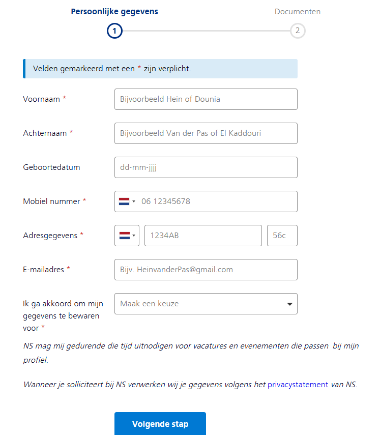
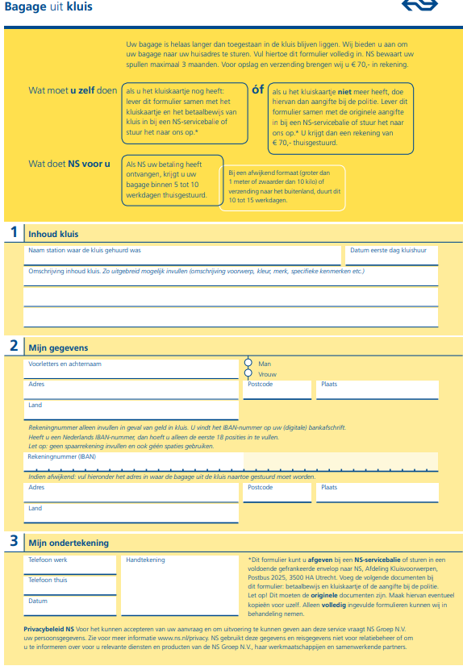
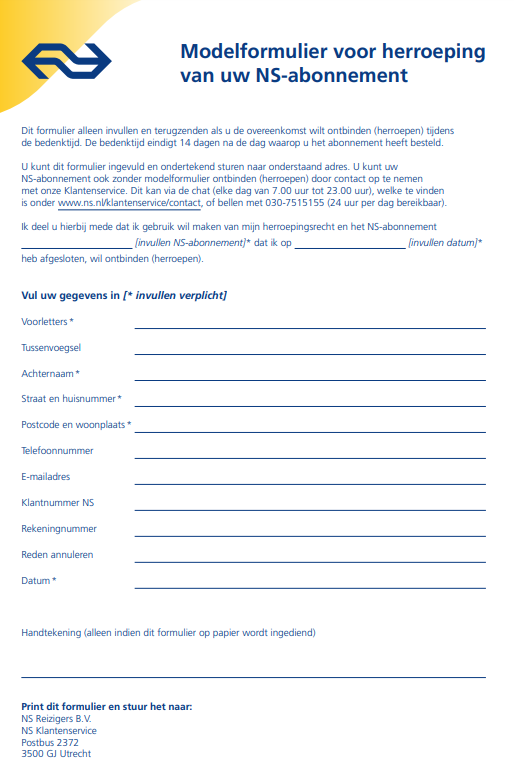
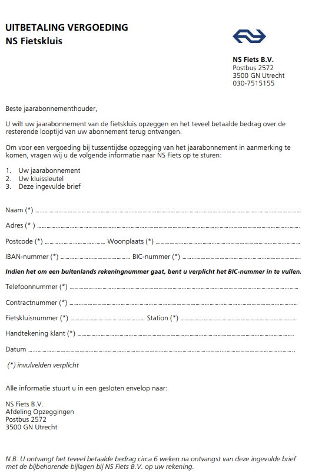

Technische eisen dingen:
invul vakjes voor tekst, cijfers, datums
vink knopjes
compatible voor elk device
Als de site herladen wordt, blijft alles ingevuld

Handig om te hebben
een manier om te checken of iets ingevulds valide is.
Vragen dichtklappen als de optie "nee. ga verder met vraag x" is ingedrukt.
Ingevulde tekst leegmaken "nee. ga verder met vraag x" is ingedrukt.
Kunnen klikken op woorden voor een popup met uitleg.

design

startscherm heeft startknop en een 'meer informatie' knop.

Elk scherm heeft een vraag (1a, 1b, 1c etc)

Als je een vraag kan overslaan vouwt het onnodige gedeelte in.

# proces week 2

Ik ben begonnen met vraag 1 uitwerken en uitvogelen hoe fieldsets en al die verschillende input velden werken. Met hulp van Dannii heb ik gemaakt dat sectie 1b kan verdwijnen en dat het bestand toevoegen knop verschijnt. Dit deden we met een has() en vervolgens heb ik dat zelf verandert zodat het css nesting gebruikt. Ik heb ook de ns fundamentels site bekeken en heb daar de kleuren uitgehaald.

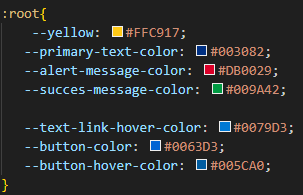
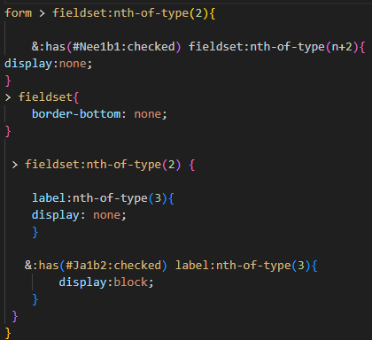
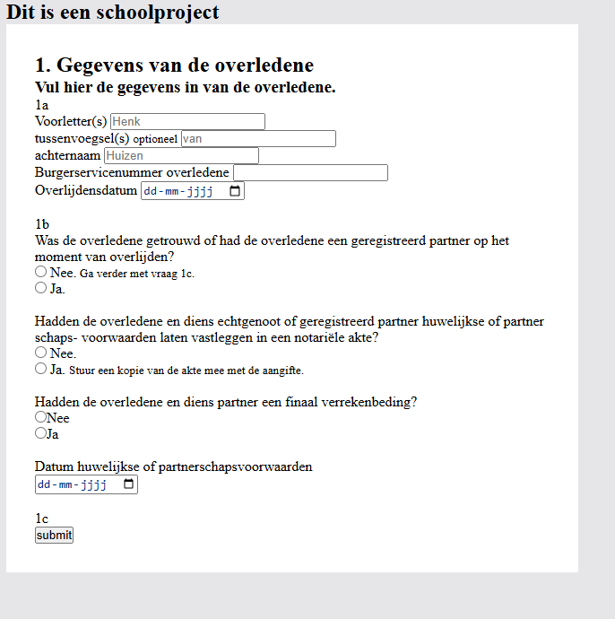

Ik was niet blij met hoe het er tot nu toe uitzag dus ik ben bezig geweest met de fonts en een beetje de stijl van de NS overnemen. Ook heb ik een les HTML + CSS validatie gevolgd waarna ik dat heb toegevoegd heb in mijn project.

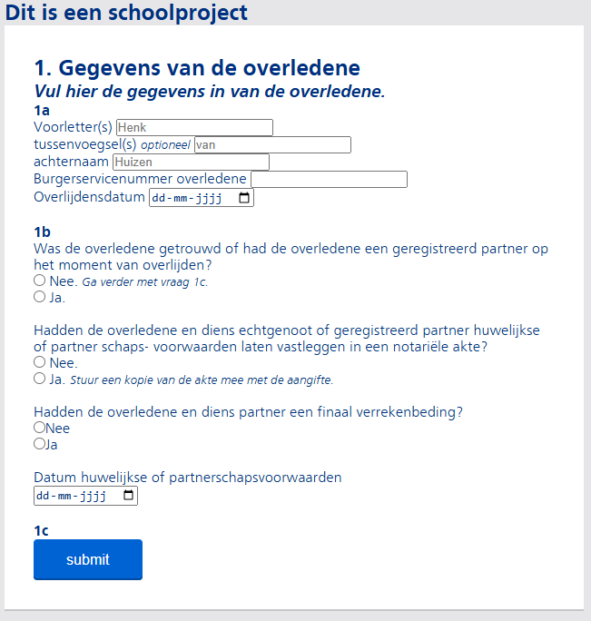

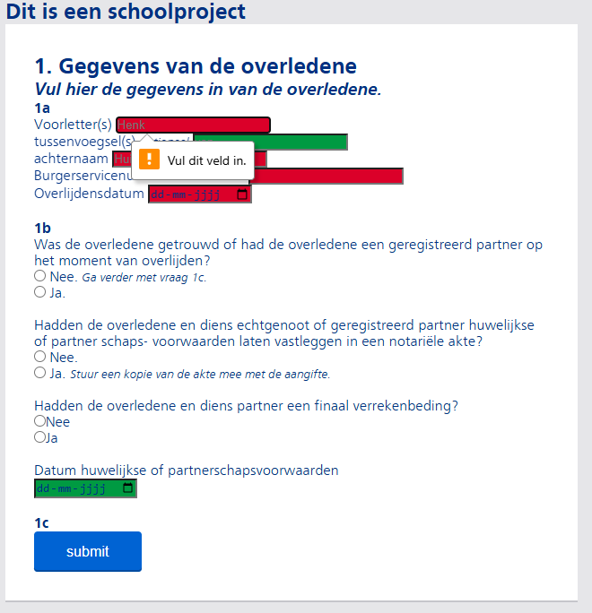

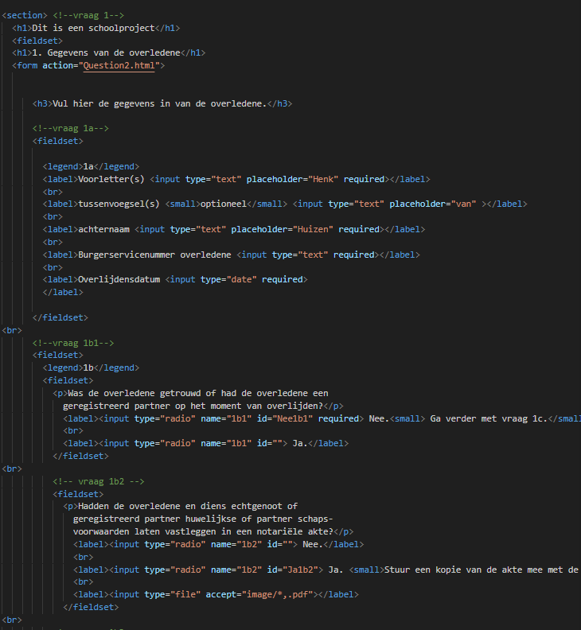

Ik gebruik ook een grid net zoals de NS website. En ik wou dat het vlak verdween bij een bepaalde scherm grote, maar dat wou niet lukken. Dus toen liet Daanni me het zien via flexbox. Wat wel werkte, maar ik wou weten waarom het niet werkte met het grid dus toen vroeg ik het aan Dante, die ook een grid gebruikt en ik had het goed gedaan, maar het grid werkte net iets anders dan ik dacht. Ik had 'grid-column: 0 / 6;' gebruikt, maar het moest 'grid-column: 1 / 7;' zijn en dat was het enigste wat mis was.

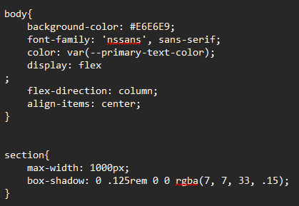

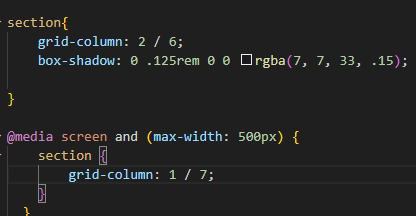

## feedback, vooruitgang & volgende week

### feedback

* gebruik gamification
* alles op een pagina, om je meer uit te dagen

### vooruitgang

* vraag 1 gemaakt
* input velden goed en fout
* vraag 1b kunnen inklappen
* iets van de opmaak

### volgende week

* vinkje en kruisje toevoegen als iets nog moet ingevuld worden
* vraag 4 meerdere erfgenamen op een manier doen
* de styling verbeteren?

## bronnen

https://www.ns.nl/platform/fundamentals/index.html

https://www.w3schools.com/css/css3_mediaqueries_ex.asp

https://developer.mozilla.org/en-US/docs/Web/CSS/CSS_grid_layout