Hallo dit wordt een belastings formulier in de stijl van de NS. Dit is een schoolopdracht!!!.

# proces week 1

Deze week heb ik gekeken naar de verschillende formulieren de op de NS website te vinden zijn. Ik heb ook de eisen opgeschreven en dingen die leuk zijn voor de gebruiker die alleen online kunnen. Hiermee heb ik een design gemaakt. Ik heb ook een workshop van

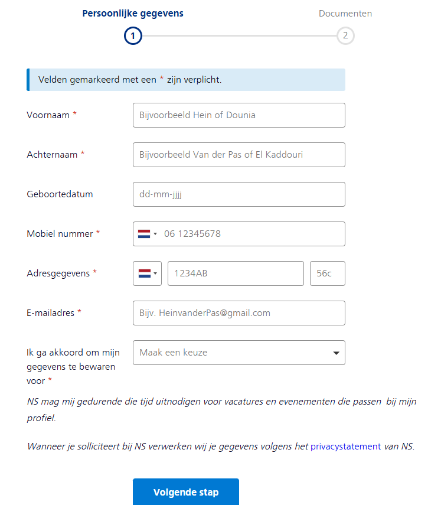
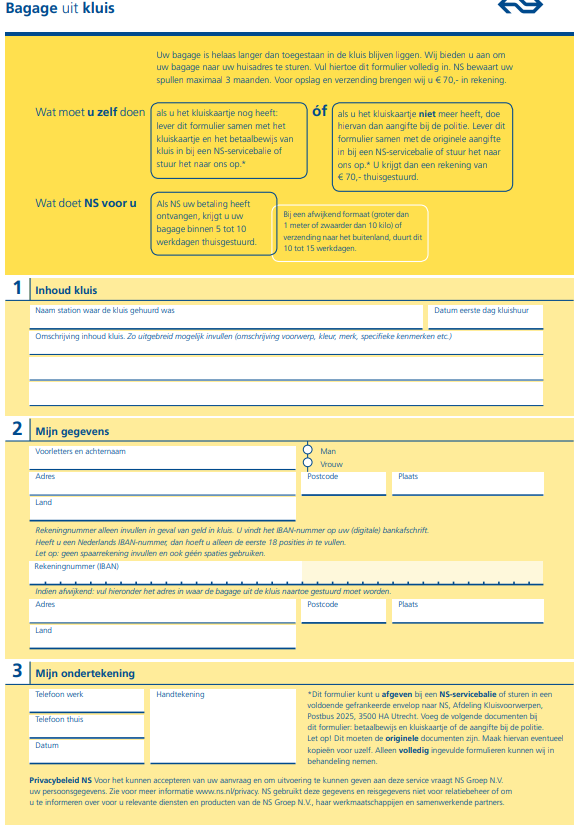
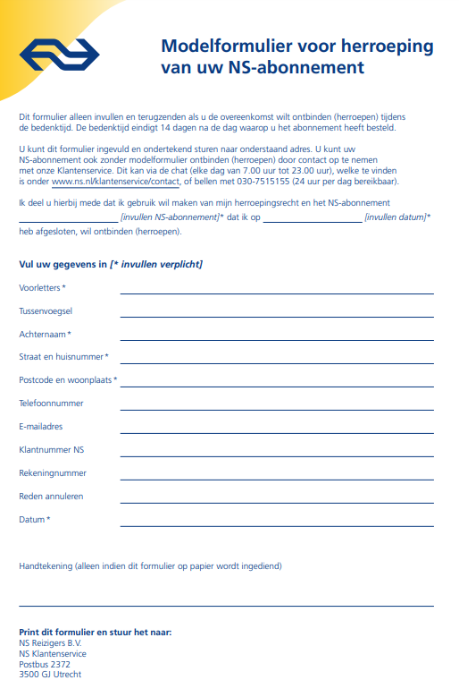
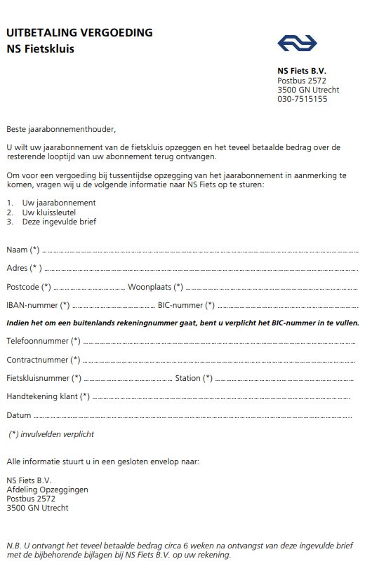

## Technische eisen
* invul vakjes voor tekst, cijfers, datums
* vink knopjes
* compatible voor elk device
* Als de site herladen wordt, blijft alles ingevuld

**Interessante design onderdelen om te maken**
* Een manier om te checken of iets ingevulds valide is.
* Vragen dichtklappen als de optie "nee. ga verder met vraag x" is ingedrukt.
* Ingevulde tekst leegmaken "nee. ga verder met vraag x" is ingedrukt.
* Kunnen klikken op woorden voor een popup met uitleg.


## design

* startscherm heeft startknop en een 'meer informatie' knop.
* Elk scherm heeft een vraag (1a, 1b, 1c etc)
* Als je een vraag kan overslaan vouwt het onnodige gedeelte in.

## bronnen

NS: https://www.ns.nl/
https://www.werkenbijns.nl/vacatures
Kijk bij formulieren: https://www.ns.nl/voorwaarden.html

https://zeroheight.com/4a05a30ad/p/04b3ac-nessie--ns-design-system

https://valsplat.nl/work/een-design-system-van-wereldklasse

# proces week 2

Ik ben begonnen met vraag 1 uitwerken en uitvogelen hoe fieldsets en al die verschillende input velden werken. Met hulp van Elton heb ik gemaakt dat sectie 1b kan verdwijnen en dat het bestand toevoegen knop verschijnt. Dit deden we met een has() en vervolgens heb ik dat zelf verandert zodat het css nesting gebruikt. Ik heb ook de ns fundamentels site bekeken en heb daar de kleuren uitgehaald.

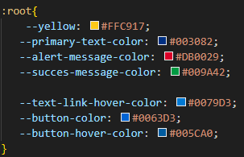
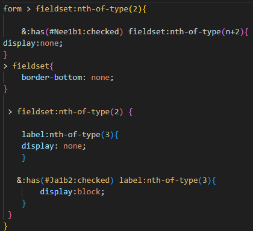
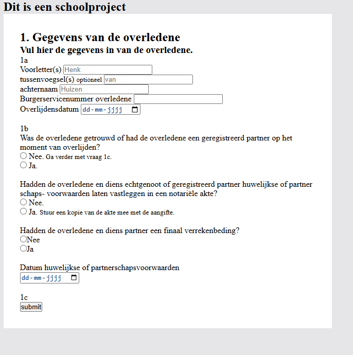


Ik was niet blij met hoe het er tot nu toe uitzag dus ik ben bezig geweest met de fonts en een beetje de stijl van de NS overnemen. Ook heb ik een les HTML + CSS validatie gevolgd waarna ik dat heb toegevoegd heb in mijn project.

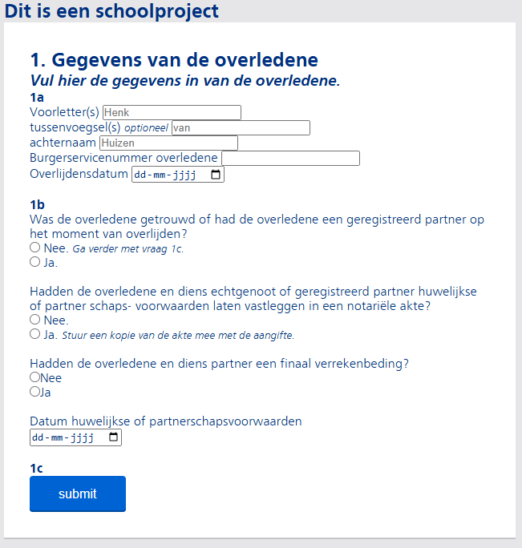

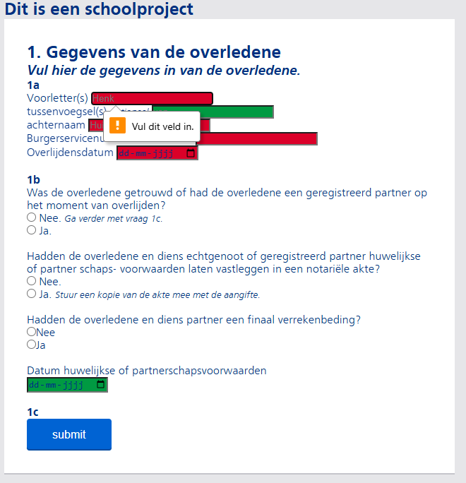

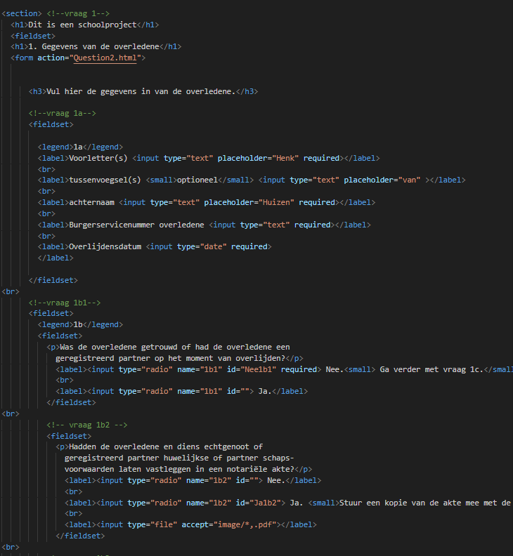

Ik gebruik ook een grid net zoals de NS website. En ik wou dat het vlak verdween bij een bepaalde scherm grote, maar dat wou niet lukken. Dus toen liet Elton me het zien via flexbox. Wat wel werkte, maar ik wou weten waarom het niet werkte met het grid dus toen vroeg ik het aan Dante, die ook een grid gebruikt en ik had het goed gedaan, maar het grid werkte net iets anders dan ik dacht. Ik had 'grid-column: 0 / 6;' gebruikt, maar het moest 'grid-column: 1 / 7;' zijn en dat was het enigste wat mis was.

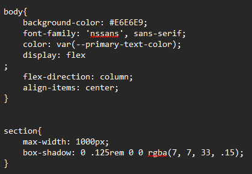

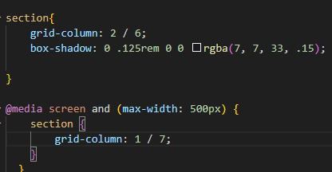

## feedback, vooruitgang & volgende week

### feedback

* gebruik gamification
* alles op een pagina, om je meer uit te dagen

### vooruitgang

* vraag 1 gemaakt
* input velden goed en fout
* vraag 1b kunnen inklappen
* iets van de opmaak

### volgende week

* vinkje en kruisje toevoegen als iets nog moet ingevuld worden
* vraag 4 meerdere erfgenamen op een manier doen
* de styling verbeteren?

## bronnen

fundamentels: https://www.ns.nl/platform/fundamentals/index.html

mediaqueries: https://www.w3schools.com/css/css3_mediaqueries_ex.asp

grid: https://developer.mozilla.org/en-US/docs/Web/CSS/CSS_grid_layout


# proces week 3

Ik begon met het kijken naar mijn stijl, omdat ik er nog steeds niet blij mee was. Ik begon met het oppervlakkige uitterlijk zoals de positie het hele blok van onderkant halen en dat soort kleine dingen.

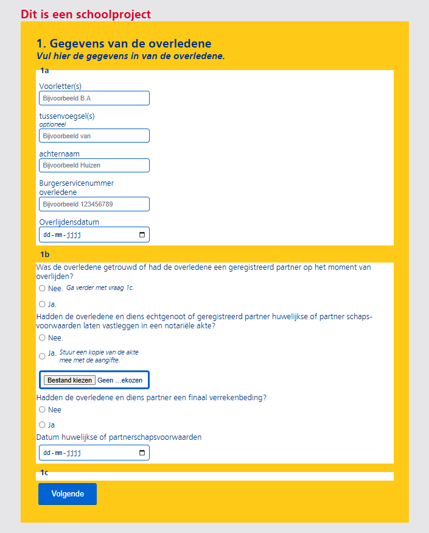

Vervolgens ging ik kijken naar validatie. Ik had het vorige week toegevoegd, maar nog niet gestyled. Ik begon met de tekstboxjes zelf stijlen en vervolgens heb ik inspiratie genomen van Dante hoe hij de foutmeldingen liet zien.

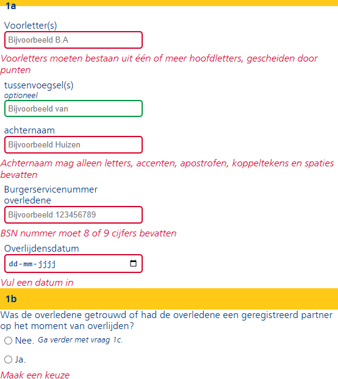

Ik heb vervolgens gekeken naar vraag 4, specifiek naar meerdere verkrijgers toevoegen. Ik had in gedachte om de gebruiker een getal te laten invoeren en dan te klikken op genereren. Dit lukte met behulp van veel zoeken en chatGPT, maar ik was er niet tevreden mee. Het had ook een paar grote fundamentele fouten zoals je kon meerdere keren op de knop drukken en het bleef maar nieuwe secties aanmaken.

<video controls src="images/20250319-2145-34.9823960.mp4" title="Title"></video>

Vervolgens ging weer verder met validatie. Ik wou dat als je een vlak openvouwde dat die vragen dan ook verplicht zouden worden. En dan natuurlijk ook weer terug gaan naar niet verplicht. Hiervoor was javascript nodig wat ik eigenlijk nog vrij weinig heb gebruikt. De eerste versie had get elementbyId en was specifiek voor 1 knop. Vervolgens had ik een versie gemaakt met getelementsbyname wat ik persoonlijk mooier vind, want dan worden bijvoorbeeld alle radio buttons op required gezet. Op deze manier werkte mijn validatie code ook. Dus nu wist ik hoe ik het wou doen en toen was het alleen nog maar herbruikbaar maken. Dit heb ik gedaan met hulp van chatGPT, want wat ik had geschreven werkte niet en vervolgens ook om te bug fixen. Een probleem waar ik tegen aanliep was dat in html je niet "aanhalingstekens" kan gebruiken, maar het kon wel als ik 'tremas' gebruikte.

```js
//first version
function RequiredOnnOff(){
    var chkYes = document.getElementById("Nee1b1");

var test = document.getElementById("Ja1b2");
var test2 = document.getElementById("kIP");

if(chkYes.checked){
    test.removeAttribute("required");
    test2.removeAttribute("required");
}
else{
    test.setAttribute("required", true);
    test2.setAttribute("required", true);
    console.log(test, test2);
}
}

//second version
function RequiredOnnOff(){
var chkYes = document.getElementById("Nee1b1");
var test = document.getElementsByName("1b3");

if(chkYes.checked){
    test.forEach(input => input.removeAttribute("required"));
}
else{
    test.forEach(input => input.setAttribute("required", "true"));
    console.log(test);
}
}

// final version
function RequiredOnnOff(inputNames, shouldRequire){
inputNames.forEach(name => {
var inputElement = document.getElementsByName(name);
    if (shouldRequire){
        inputElement.forEach(input => input.setAttribute("required", "true"));
    }else{
        inputElement.forEach(input => input.removeAttribute("required"));
    }
});
}
 ```
<video controls src="images/20250319-2214-14.0280402.mp4" title="Title"></video>

## bronnen

Turning on/off the required attribute:
https://developer.mozilla.org/en-US/docs/Web/API/Document/getElementsByName
https://stackoverflow.com/questions/40434416/setting-and-removing-the-required-attribute-using-javascript-and-html5#:~:text=You%20could%20use%20.,directly%20operate%20on%20the%20element.
https://www.aspsnippets.com/Articles/1981/RadioButton-OnClick-event-example-in-JavaScript/


https://www.w3schools.com/tags/tag_template.asp

## proces week 4

Deze week wou ik toch nog een keer kijken naar het dupliceren van html gedeeltes. De basis had ik al, maar ik vond de uitvoering toch niet zo mooi. Dus ik heb het invoer verandert naar een knop die een nieuw veld maakt, geïnspireerd door Vivanne. Dit was redelijk makkelijk om te veranderen, maar nu moest ik ervoor zorgen dat de knop niet steeds dubbel kwam te staan. Heel simpel om uit de template te halen, maar toen werkte het plaatsen niet. Quy om advies gevraagd en hij zei dat hij van plan was om de knop te verwijderen. Dit had ik dus gedaan, maar toen zei Quy later waarom de volgende en vorige knoppen zo slecht waren neergezet in mijn html, dus ik had het verplaatst en toen hoefde de knop verplaats code niet meer.

```js
function generateFieldsets(button) {
  let parent = button.closest("#ButtonGroup");
    parent.style.display = "none";
}
```

Ik had ook het probleem dat als je klikte op de genereer knop klikte het nieuwe vragenlijstje niet goed tevoorschijn kwam. Hiervoor moest ik een lege div toevoegen met een id, om vervolgens de template daarin te spawnen, wat werkte.

```js
let verkrijgerCount = 1;
function generateFieldsets(button) {
  let temp = document.getElementsByTagName("template")[0];
  let clon = temp.content.cloneNode(true);

  // geïnspireerd door Quy
  let legend = clon.querySelector("legend");
  if (legend) {
    verkrijgerCount++;
    legend.textContent = `verkrijger ${verkrijgerCount}`;
  }

  //met chatGPT
  document.getElementById("SpawnQuestions").appendChild(clon);
}
```

Toen dit allemaal werkte moest ik het nog javascript failproof maken. Mede doordat ik weinig tijd had en ook geïnspireerd door Quy, heb ik het vragenlijstje 4 keer gekopiërd, in een div gezet en die wordt op non-actief gezet met javascript. Dus als javascript werkt is het er niet.

Nu had ik dat de vragenlijsten javascript proof, maar ik had ook nog de genereer button. Eerst zette ik deze op non-actief met css. Wat werkte, maar als javascript en css niet werken dat was de knop er nog en deed het niks. Oftewel niet gebruikersvriendelijk. ChatGPT gaf me allemaal domme oplossingen om die knop aan en uit te zetten. Ik wou het doen met javascript, maar wist niet hoe en chatgpt gaf me onclick events, maar dat werkt niet want ik heb ook een functie voor de required die erop zat. Dus chatgpt hielp niet, dus ik vroeg of je simpelweg 2 functies kan aanroepen in html en dat kan. Dus heel simpel opgelost.

```js
// geinspireerd bij Quy
document.addEventListener("DOMContentLoaded", () =>{
  document.getElementById("JavascriptFailed").style.display="none";
  TurnOffButton()
});

function TurnOffButton(){
  document.getElementById("GenerateButton").style.display= "none";
}
function TurnOnButton(){
  document.getElementById("GenerateButton").style.display= "block";
}
```


<video controls src="20250320-0909-46.9116462.mp4" title="Title"></video>

<video controls src="20250320-0911-30.5535092.mp4" title="Title"></video>

## bronnen

Quy

https://chat.openai.com/

https://developer.mozilla.org/en-US/docs/Web/API/Node/appendChild

## reflectie

Ik vond dit een moeilijke opdracht, omdat ik geen idee had wat goede html is. Ik wist ook niet zo goed waar ik op moest focussen en toen ik het vroeg aan Krijn kreeg ik niet echte nuttige feedback.

# proces herkansing

Ik begon met het kijken naar de html. Ik herinnerde me nog dingen die Vasilis had gezegd tijdens de originele beoordeling en die heb ik als eerste gefixt. Hierdoor ging mijn styling kapot, maar ik besloot dat te negeren.

* Ik begon met alle headers goed te gebruiken.
* Na elke fieldset een legend neergezet.
* Ik had waarschuwings code van Dante en hij had een verbeterde versie die ik heb gepakt.
* Ik heb de namen van de variabelen naar de goede soort gezet: bijvoorbeeld-dit InplaatsVanDit.
* De sectie vervangen door een main.
* Een header gebruikt voor de waarschuwing.
* classes gebruikt voor de styling
* styling gefixed

## toevoegingen

Ik had een paar kleine javascript dingen die ik moest toevoegen.

1. niet in de toekomst sterven
2. velden kunnen verwijderen

De eerste heb ik aan chatGPT gevraagd, want ik had geen idee hoe ik dat moest doen. Als ik het goed snapt, pakt hij de datum in const today. Vervolgens pakt hij alle date input fields en stopt daar de max attribute op. Dit is heel logisch, maar ik wist niet hoe ik de datum kon pakken.

```js
document.addEventListener("DOMContentLoaded", () => {
  const today = new Date().toISOString().split("T")[0];
  const allDateInputs = document.querySelectorAll('input[type="date"]');

  allDateInputs.forEach((input) => {
    input.max = today;
  });
});
```

De tweede toevoeging was niet zo simpel als het lijkt, zie javascript bugs. Ik wist niet hoe ik het moest doen, dus ik vroeg het aan chatGPT en toen ik zag wat het deed dacht ik aan een andere manier om het te doen. Ik kan namelijk een class geven aan de template en dan de lijst van classes ophalen en de laatste in die lijst verwijderen.

## javascript bugs

De eerste bug die ik had gefixed was bij vraag 1, er was een manier om een ontzichtbare vraag alsnog required te hebben, waardoor je niet naar de volgende pagina kon. Dit heb ik redelijk simpel opgelost door een if-statement erin te gooien die checked of de toekomstige radiobutton is aangevinkt.

```js
document.getElementById("Ja1b1").addEventListener("change", function () {
  RequiredOnnOff(["1b2", "1b3", "1b4"], true);

  if (document.getElementById("Ja1b2").checked) {
    RequiredOnnOff(["1b2.1"], true);
  }
});

document.getElementById("Nee1b1").addEventListener("change", function () {
  RequiredOnnOff(["1b2", "1b3", "1b4", "1b2.1"], false);
});
```

De grootste bugs kwamen door het genereren van nieuwe secties html. Om bij het begin te beginnen, elke input heeft een originele naam nodig om het op te kunnen sturen naar de 'server'. Dit heb ik kunnen doen op dezelfde manier als hoe ik de naam verander. Ik zoek naar alle input attributen en gooi daar de originele naam + de verkrijgercounts in.

```js
let inputs = clon.querySelectorAll("input");
inputs.forEach((input) => {
    let originalName = input.getAttribute("name");
    input.setAttribute("name", `${originalName}_${verkrijgerCount}`);
  });
```

Nu kwam het volgende probleem. Toen ze dezelfde naam hadden werden ze required en niet required door de bestaande functie, maar nu ze een nieuwe naam hadden werkte dat niet meer. Ik heb een paar verschillende variaties gemaakt en het eindproduct is naar mijn mening het meest optimized. De code werkt als volgt: Ik maak een variabel met alle originele namen en daarna loop ik door alle inputs in de verkrijger class en die push ik in de array. Dit deed ik in elke button, wat niet nodig is. Dus dit heb had ik vervolgens in een functie gezet, en toen riep ik de functie overal aan, wat precies hetzelfde is eigenlijk alleen wat korter. Dus de laatste versie heeft een publieke variabel en ik update de lijst bij het aanmaken en verwijderen van secties. 

```js
let question3Names = ["3b2", "3b3", "3b5", "3b6", "3b7"];
function UpdateList() {
  question3Names = ["3b2", "3b3", "3b5", "3b6", "3b7"];

  document.querySelectorAll(".verkrijgers input").forEach((input) => {
    if (!input.name.includes("3b4")) {
      question3Names.push(input.name);
    }
  });

  console.log(question3Names);
}

document
  .getElementById("generate-button").addEventListener("click", function () {
    generateFieldsets();
    UpdateList();
    RequiredOnnOff(question3Names, true);
  });

```

Nu kwam ik ook achter een andere bug hierdoor. de 'tussenvoegsel' werd ook required, wat niet moet. Dit was gelukkig een makkelijke oplossing door een if-statement te maken die alles exclude wat 3b4 in de naam heeft.

```js 
if (!input.name.includes("3b4")) {
      question3Names.push(input.name);
    }
```

Als javascript niet werkt, heb ik een failsafe. Deze failsafe moest ook namen hebben voor de input fields. Dit gaf een error, omdat de code deze ontzichtbare vragen ook required maakte, waardoor je niet verder kon. Dit heb ik opgelost door het in een <noscript> te zetten.

```html
<noscript id="javascript-failed">
  <!-- inhoud -->
</noscript>
```

Als laatste was er een kleine bug, als ik naar de vorige pagina ging met de browser waren de radiobuttons en alles nog ingedrukt, maar de genereer en verwijder button waren er niet. Dit was op te lossen door de  onpageload te veranderen naar window event listerner pageshow.

```js
window.addEventListener("pageshow", () => {
  if (document.getElementById("Ja3b1").checked) {
    TurnOnButton();
  } else {
    TurnOffButton();
  }
});
```