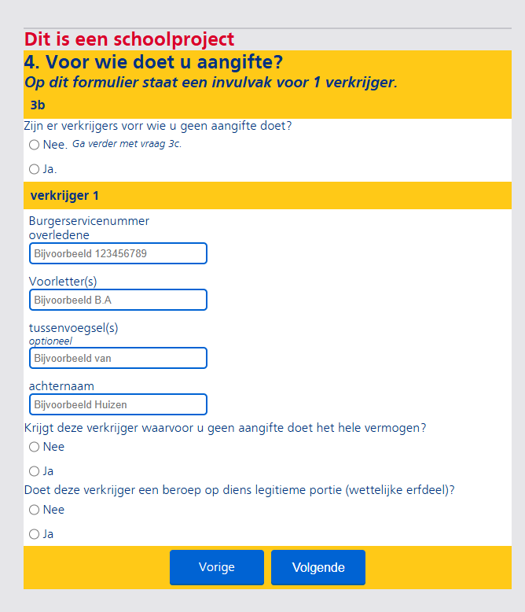

Hallo dit wordt een belastings formulier in de stijl van de NS.

NS: https://www.ns.nl/
https://www.werkenbijns.nl/vacatures
Kijk bij formulieren: https://www.ns.nl/voorwaarden.html

Technische eisen dingen:
invul vakjes voor tekst, cijfers, datums
vink knopjes
compatible voor elk device
Als de site herladen wordt, blijft alles ingevuld

Handig om te hebben
een manier om te checken of iets ingevulds valide is.
Vragen dichtklappen als de optie "nee. ga verder met vraag x" is ingedrukt.
Ingevulde tekst leegmaken "nee. ga verder met vraag x" is ingedrukt.
Kunnen klikken op woorden voor een popup met uitleg.